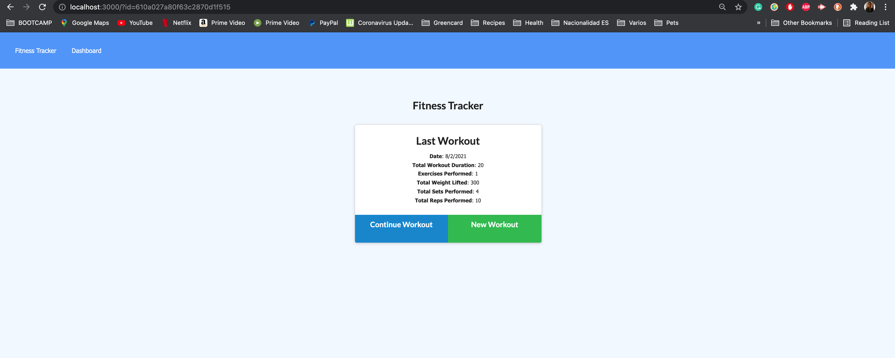
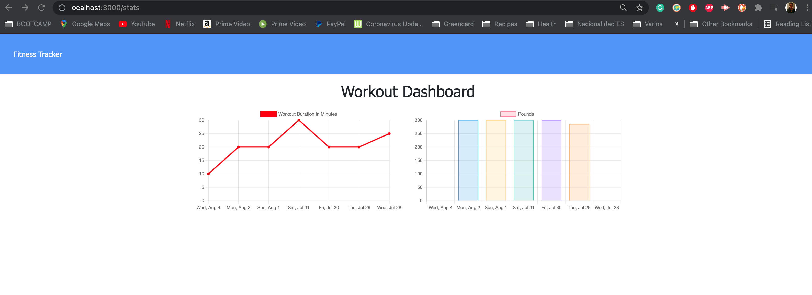

# Workout Tracker 

# Description

This app gives the user the opportunity to create a workout, add different exercises and keep track of distance, weight lifted, duration and reps.

## Deployed link to the app on Heroku

https://quiet-crag-39562.herokuapp.com/?id=610b4ad83d6a8d001502b06a

## Screenshots of Workout Tracker

# Table of Contents

* [Installation](#installation)
    
* [Usage](#usage)

* [Technology](#technology)

* [License](#license)

* [Contributing](#contributing)

* [Questions](#questions)

# Installation

Visit the deployed app and start a workout on the following link: https://quiet-crag-39562.herokuapp.com/?id=610b4ad83d6a8d001502b06a

# Usage

The user can add different exercises to the workout. This app will keep track of the user's workouts and give the user a summary of the type of exercises they have perfomed, distance, weight lifted, duration and reps. It also gives the user a graph of duration and pounds lifted in the last 6 days.

# Technology

* MongoDB
* Mongoose
* Node
* Express
* Mongo Atlas
* Heroku

# License 

This project is governed by: MIT License

# Contributing

Blenda Orellana

# Questions

If you have any questions about the repo or the app please feel free to contact me
 * Email: blen.or90@gmail.com
 * Github: https://github.com/blen90
